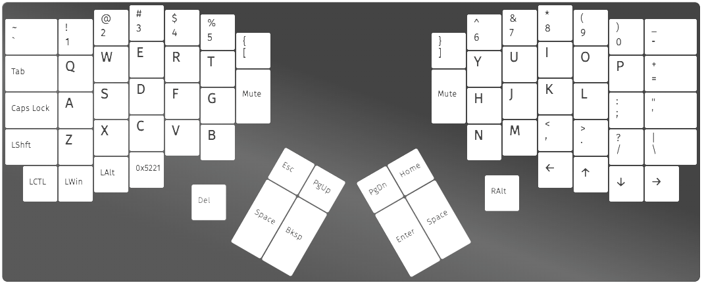

### Neodox - OLED customization, German Umlauts
this repository includes keymaps used for German Umlauts on the second layer

the OLED customization is inspired by:
* [oled_pet from drashna](https://gist.github.com/drashna/5d13593d1f2e36677aee920448edd73a)
* [oled font from ergohaven](https://github.com/ergohaven/vial-qmk/tree/new-oled-modes/keyboards/ergohaven)
* [superloop from hexcowboy](https://github.com/hexcowboy/superloop/tree/main)

### Neodox - Ergomech

The keyboard is the exclusive product of Ergomech Store, you can get it here: [Neodox - Ergomech Store](https://ergomech.store/shop/neodox-sandwich-style-exclusive-418)

This repo is the code to help you compile the qmk firmware by yourself
The keyboard features several advance options:

- 2 Encoders, each on both sides of the keyboard

- Underglow leds

- 2 OLEDs display, one on each sides of the keyboards

The firmware is fully supported by VIAL, this is the firmware folder for compiling the firmware.

### How to compile the firmware

- Download this repo and unzip it, rename the folder to `neodox_ergomech`

- Clone [VIAL-QMK repo](https://github.com/vial-kb/vial-qmk)

- Copy the Newdox folder to `vial-qmk/keyboards`
 
- Compile the custom firmware: `qmk compile -kb neodox_ergomech/rev1 -km vial`

### How to flash the firmware

- Hold the reset button on the bottom of the pcb 

- Plug in the usb cable while holding the reset button

- Release the reset button as soon as the usb cable is plugged

- An USB drive should appears in your PC

- Copy the UF2 firmware file generated by compiling steps

- The Drive will immediately disconnect, this is normal, the firmware is flashed

### VIAL/VIA firmware
The keyboard come preflashed with [VIAL](https://vial.rocks) compatible firmware, and if you don't wish to dwell into the code just yet, it's perfectly fine to use [VIAL](https://vial.rocks) to config the keyboard.

